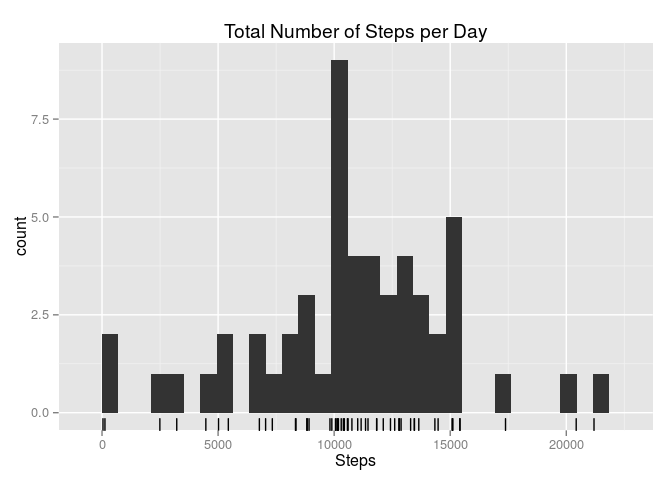
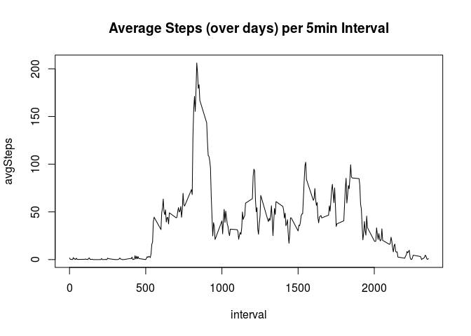
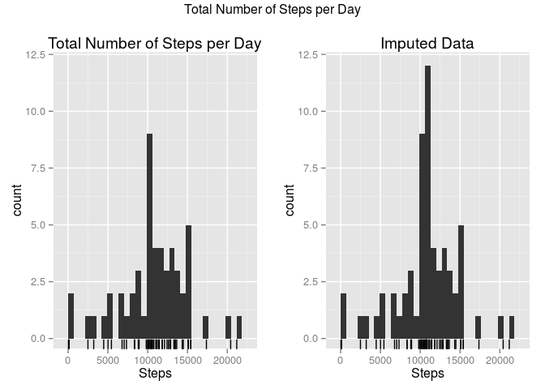
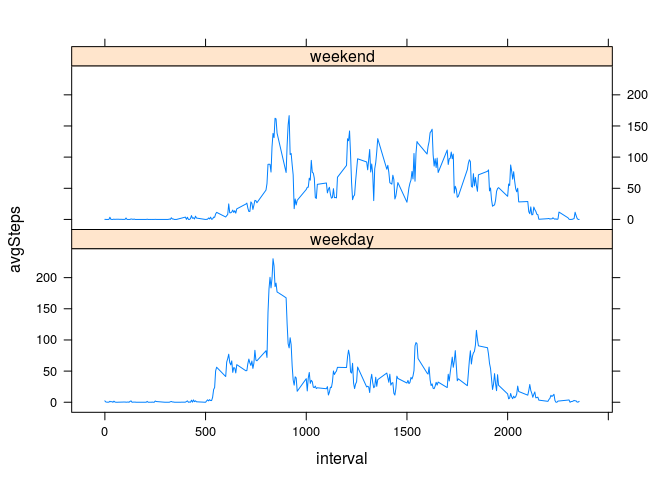

# Reproducible Research: Peer Assessment 1


## Loading and preprocessing the data


```r
unzip("./activity.zip")
activity <- read.csv("./activity.csv")
head(activity)
```

```
##   steps       date interval
## 1    NA 2012-10-01        0
## 2    NA 2012-10-01        5
## 3    NA 2012-10-01       10
## 4    NA 2012-10-01       15
## 5    NA 2012-10-01       20
## 6    NA 2012-10-01       25
```

```r
tail(activity)
```

```
##       steps       date interval
## 17563    NA 2012-11-30     2330
## 17564    NA 2012-11-30     2335
## 17565    NA 2012-11-30     2340
## 17566    NA 2012-11-30     2345
## 17567    NA 2012-11-30     2350
## 17568    NA 2012-11-30     2355
```

```r
str(activity)
```

```
## 'data.frame':	17568 obs. of  3 variables:
##  $ steps   : int  NA NA NA NA NA NA NA NA NA NA ...
##  $ date    : Factor w/ 61 levels "2012-10-01","2012-10-02",..: 1 1 1 1 1 1 1 1 1 1 ...
##  $ interval: int  0 5 10 15 20 25 30 35 40 45 ...
```

```r
# Create raw data variable for section ## Imputing Missing Values
activityRaw <- activity

# Remove steps == NA rows
activity <- activity[apply(!is.na(activity), 1, all), ]
str(activity)
```

```
## 'data.frame':	15264 obs. of  3 variables:
##  $ steps   : int  0 0 0 0 0 0 0 0 0 0 ...
##  $ date    : Factor w/ 61 levels "2012-10-01","2012-10-02",..: 2 2 2 2 2 2 2 2 2 2 ...
##  $ interval: int  0 5 10 15 20 25 30 35 40 45 ...
```

```r
# activity
```


## What is mean total number of steps taken per day?

Missing values (NA) are ignored.

1. Calculate the total number of steps taken per day.


```r
# Split df by date
library(dplyr)
```

```
## 
## Attaching package: 'dplyr'
## 
## The following objects are masked from 'package:stats':
## 
##     filter, lag
## 
## The following objects are masked from 'package:base':
## 
##     intersect, setdiff, setequal, union
```

```r
activityByDay <- group_by(activity, date)

# Create new df with "total steps per day"
activityByDay <- summarise(activityByDay, totalSteps = sum(steps))
activityByDay
```

```
## Source: local data frame [53 x 2]
## 
##          date totalSteps
## 1  2012-10-02        126
## 2  2012-10-03      11352
## 3  2012-10-04      12116
## 4  2012-10-05      13294
## 5  2012-10-06      15420
## 6  2012-10-07      11015
## 7  2012-10-09      12811
## 8  2012-10-10       9900
## 9  2012-10-11      10304
## 10 2012-10-12      17382
## ..        ...        ...
```

2. Histogram of total number steps per day


```r
library(ggplot2)

p1 <- ggplot(activityByDay, aes(x = totalSteps)) + 
    geom_histogram() + 
    geom_rug() + 
    ggtitle("Total Number of Steps per Day") + 
    xlab("Steps")
p1
```

```
## stat_bin: binwidth defaulted to range/30. Use 'binwidth = x' to adjust this.
```

 

3. Calculate and report the mean and median of the total number of steps taken per day


```r
activityStats <- summary(activityByDay$totalSteps)
activityStats
```

```
##    Min. 1st Qu.  Median    Mean 3rd Qu.    Max. 
##      41    8841   10760   10770   13290   21190
```

```r
cat("Total number of steps per day mean =", activityStats[4], "; median =", activityStats[3])
```

```
## Total number of steps per day mean = 10770 ; median = 10760
```


## What is the average daily activity pattern?

1. Make a time series plot of the 5-minute interval (x-axis) and the average number of steps taken, averaged across all days (y-axis)


```r
# Group by interval
activityByItvl <- group_by(activity, interval)

# Create new df with "average steps over days"
activityByItvl <- summarise(activityByItvl, avgSteps = mean(steps))
activityByItvl
```

```
## Source: local data frame [288 x 2]
## 
##    interval  avgSteps
## 1         0 1.7169811
## 2         5 0.3396226
## 3        10 0.1320755
## 4        15 0.1509434
## 5        20 0.0754717
## 6        25 2.0943396
## 7        30 0.5283019
## 8        35 0.8679245
## 9        40 0.0000000
## 10       45 1.4716981
## ..      ...       ...
```

```r
# Time series plot
with(activityByItvl, plot(interval, avgSteps, type = "l", main = "Average Steps (over days) per 5min Interval"))
```

 

2. Which 5-minute interval, on average across all the days in the dataset, contains the maximum number of steps?


```r
itvlIdx <- which.max(activityByItvl$avgSteps)
cat("The ", activityByItvl$interval[itvlIdx], "th 5-min interval contains the maximum average number of steps (across all days).", sep = "")
```

```
## The 835th 5-min interval contains the maximum average number of steps (across all days).
```


## Imputing missing values

1. Calculate and report the total number of missing values in the dataset (i.e. the total number of rows with NAs)


```r
activity <- activityRaw
narows <- apply(is.na(activity), 1, any);
narowsT <- table(narows)
narowsT
```

```
## narows
## FALSE  TRUE 
## 15264  2304
```

```r
cat("Total number of missing values is:", narowsT[2])
```

```
## Total number of missing values is: 2304
```

```r
cat("Percentage of missing values is:", narowsT[2] / sum(narowsT) * 100, "%")
```

```
## Percentage of missing values is: 13.11475 %
```

```r
# activity
```

2. Devise a strategy for filling in all of the missing values in the dataset. The strategy does not need to be sophisticated. For example, you could use the mean/median for that day, or the mean for that 5-minute interval, etc.

Approach: Since NAs exist for single whole days, impute data using mean for each 5-minute interval

3. Create a new dataset that is equal to the original dataset but with the missing data filled in.


```r
activityImpute <- activity

# Impute steps: use average steps (over days) for current interval
for (idx in which(narows)) {
    itvl <- activity$interval[idx]
    avgStepsOfItvl <- activityByItvl$avgSteps[which(activityByItvl$interval == itvl)]
    activityImpute$steps[idx] <- avgStepsOfItvl
}
head(activityImpute)
```

```
##       steps       date interval
## 1 1.7169811 2012-10-01        0
## 2 0.3396226 2012-10-01        5
## 3 0.1320755 2012-10-01       10
## 4 0.1509434 2012-10-01       15
## 5 0.0754717 2012-10-01       20
## 6 2.0943396 2012-10-01       25
```

4. Make a histogram of the total number of steps taken each day and Calculate and report the mean and median total number of steps taken per day. Do these values differ from the estimates from the first part of the assignment? What is the impact of imputing missing data on the estimates of the total daily number of steps?


```r
activityImputeByDay <- group_by(activityImpute, date)
activityImputeByDay <- summarise(activityImputeByDay, totalSteps = sum(steps))

# Histograms of NA-removed and imputed data (side-by-side)
p2 <- ggplot(activityImputeByDay, aes(x = totalSteps)) + 
    geom_histogram() + 
    geom_rug() + 
    ggtitle("Imputed Data") + 
    xlab("Steps")

# Get y-lims
yLimLo <- ggplot_build(p1)$panel$ranges[[1]]$y.range[1]
```

```
## stat_bin: binwidth defaulted to range/30. Use 'binwidth = x' to adjust this.
```

```r
yLimHi <- max(c(ggplot_build(p1)$panel$ranges[[1]]$y.range[2],
                ggplot_build(p2)$panel$ranges[[1]]$y.range[2]))
```

```
## stat_bin: binwidth defaulted to range/30. Use 'binwidth = x' to adjust this.
## stat_bin: binwidth defaulted to range/30. Use 'binwidth = x' to adjust this.
```

```r
# Set y-lims
p1 <- p1 + coord_cartesian(ylim = c(yLimLo, yLimHi))
p2 <- p2 + coord_cartesian(ylim = c(yLimLo, yLimHi))

# Plot side-by-side
library(gridExtra)
grid.arrange(p1,p2, ncol = 2, top = "Total Number of Steps per Day")
```

```
## stat_bin: binwidth defaulted to range/30. Use 'binwidth = x' to adjust this.
## stat_bin: binwidth defaulted to range/30. Use 'binwidth = x' to adjust this.
```

 

```r
# main = textGrob("Total Number of Steps per Day", gp = gpar(fontsize = 20, font = 3))

# Mean and Median
imputeStats <- summary(activityImputeByDay$totalSteps)
imputeStats
```

```
##    Min. 1st Qu.  Median    Mean 3rd Qu.    Max. 
##      41    9819   10770   10770   12810   21190
```

```r
cat("Imputed data mean: ", imputeStats[4], "; median: ", imputeStats[3], sep = "")
```

```
## Imputed data mean: 10770; median: 10770
```

```r
# Difference from NA-removed data
cat("Delta mean: ", abs(activityStats[4] - imputeStats[4]), "; Delta median: ", abs(activityStats[3] - imputeStats[3]), sep = "")
```

```
## Delta mean: 0; Delta median: 10
```

These results suggest imputing missing data: 1) amplifies the frequency of more common counts (the mode) and 2) brings the median closer to the mean.


## Are there differences in activity patterns between weekdays and weekends?

For this part the weekdays() function may be of some help here. Use the dataset with the filled-in missing values for this part.

1. Create a new factor variable in the dataset with two levels – “weekday” and “weekend” indicating whether a given date is a weekday or weekend day.


```r
wdays <- weekdays(as.Date(activityImpute$date))
isWeekend <- wdays == "Saturday" | wdays == "Sunday"

activityImpute <- mutate(activityImpute, wday = factor(isWeekend, labels = c ("weekday", "weekend")))
str(activityImpute)
```

```
## 'data.frame':	17568 obs. of  4 variables:
##  $ steps   : num  1.717 0.3396 0.1321 0.1509 0.0755 ...
##  $ date    : Factor w/ 61 levels "2012-10-01","2012-10-02",..: 1 1 1 1 1 1 1 1 1 1 ...
##  $ interval: int  0 5 10 15 20 25 30 35 40 45 ...
##  $ wday    : Factor w/ 2 levels "weekday","weekend": 1 1 1 1 1 1 1 1 1 1 ...
```

```r
table(activityImpute$wday)
```

```
## 
## weekday weekend 
##   12960    4608
```

2. Make a panel plot containing a time series plot (i.e. type = "l") of the 5-minute interval (x-axis) and the average number of steps taken, averaged across all weekday days or weekend days (y-axis). See the README file in the GitHub repository to see an example of what this plot should look like using simulated data.


```r
activityImputeByWday <- group_by(activityImpute, interval, wday)
activityImputeByWday <- summarise(activityImputeByWday, avgSteps = mean(steps))
head(activityImputeByWday, 10)
```

```
## Source: local data frame [10 x 3]
## Groups: interval
## 
##    interval    wday    avgSteps
## 1         0 weekday 2.251153040
## 2         0 weekend 0.214622642
## 3         5 weekday 0.445283019
## 4         5 weekend 0.042452830
## 5        10 weekday 0.173165618
## 6        10 weekend 0.016509434
## 7        15 weekday 0.197903564
## 8        15 weekend 0.018867925
## 9        20 weekday 0.098951782
## 10       20 weekend 0.009433962
```

```r
# Lattice panel function
library(lattice)
with( activityImputeByWday, xyplot(avgSteps ~ interval | wday, type = "l", layout = c(1,2)) )
```

 


